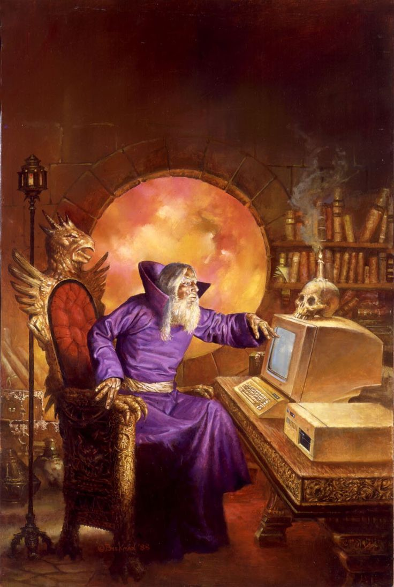
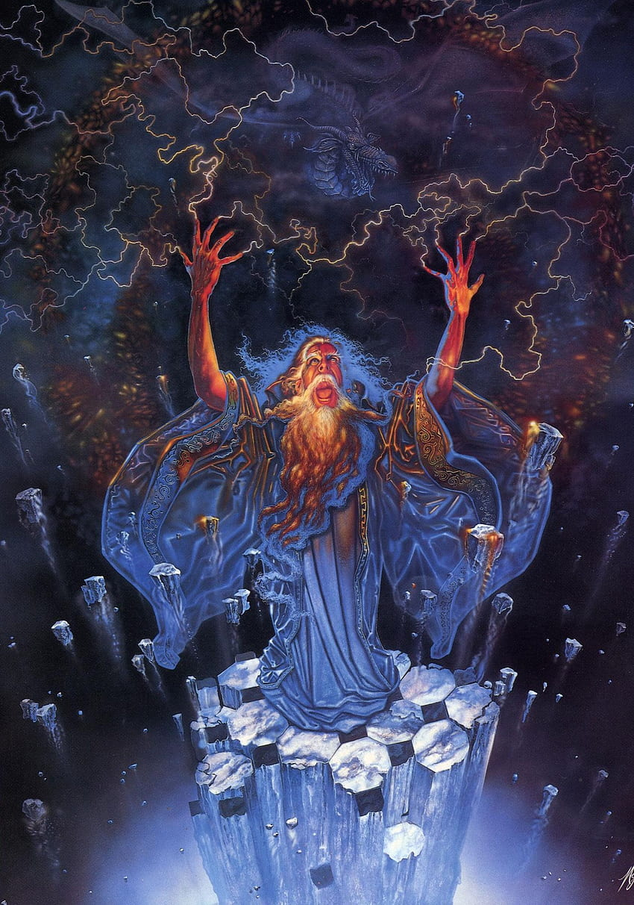

<!--
Inspirated by hyuncafe and her beutifull README

-->

<h2 align="center"> Self-taught Computer wizard trying to master spells and having fun doing so </h2>  

💠 🐍 Currently learning Python and data analysis! 🐍  
    Going trough these right now:
    - Udemy 100 Days of code: Complete Python
    - The Odin project(Fundamentals + Fullstack Ruby)
    - Udemy SQL
    - Freecodecamp  

💠 💀 Javascript is my bane   

💠 Using github as a project depository and inspiration getter   

💠 Goal is to land a field relevent job and finish my degree in the process   

💠 Gamer, Anime/manga enjoyer

<h2> late night stackoverflow search</h2>

